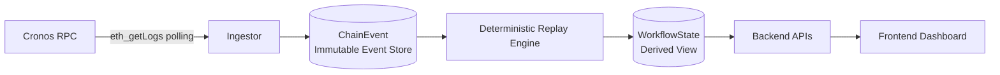
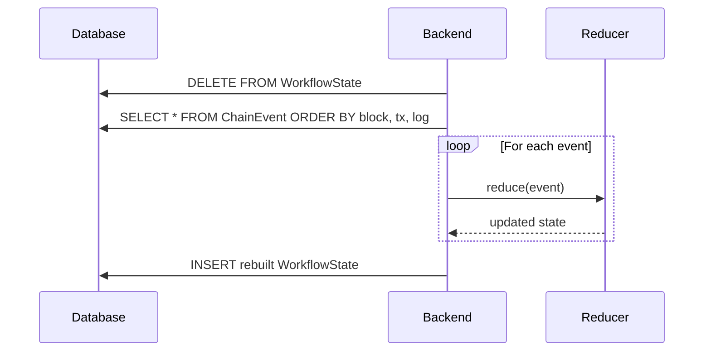

# x402 Workflow Observer

A workflow-level observability layer for x402-style agentic payments on EVM chains, starting with Cronos.

This system focuses on **deterministic reconstruction of multi-step payment workflows** from immutable on-chain events — not just displaying final settlement transactions.

Think **production-aligned observability for programmable payments**, not a block explorer.

---

## Table of Contents

- [Why This Exists](#why-this-exists)
- [Core Guarantees](#core-guarantees)
- [Non-Goals (Explicit)](#non-goals-explicit)
- [High-Level Architecture](#high-level-architecture)
- [Deterministic Reconstruction Model](#deterministic-reconstruction-model)
- [Event Ordering Guarantees](#event-ordering-guarantees)
- [Client-Side Model (Reviewer FAQ)](#client-side-model-reviewer-faq)
- [Validation (Quick Summary)](#validation-quick-summary)
- [Current Limitations](#current-limitations)
- [Positioning](#positioning)
- [Roadmap (High-Level)](#roadmap-high-level)
- [Status](#status)
- [License](#license)

---

## Why This Exists

x402 enables programmable, agent-driven payment flows.  
But as soon as payments become multi-step (intent → decision → settlement → finality), debugging becomes difficult:

- Block explorers only show final state
- Failed workflows lose execution context
- Restarts wipe in-memory monitoring state
- There is no workflow-level timeline

This project addresses that gap by treating **on-chain events as the source of truth** and reconstructing workflow state deterministically.

---

## Core Guarantees

This system **does guarantee**:

- **Deterministic reconstruction** of workflows from persisted on-chain events
- **Stateless backend recovery** (restart-safe)
- **Strict event ordering** by `(blockNumber, transactionIndex, logIndex)`
- **Immutable raw event storage**
- **Chain-derived timestamps** (`block.timestamp`, not system time)
- **Idempotent ingestion** via `(txHash, logIndex)` uniqueness
- **Polling-based ingestion** compatible with Cronos RPC

This system **does not rely on**:
- in-memory caches
- frontend-derived state
- event subscription filters

---

## Non-Goals (Explicit)

This project intentionally does **NOT** attempt to solve:

- Off-chain execution tracing (HTTP requests, agent logs)
- Facilitator or orchestrator SDK integration
- Full reorg rollback beyond confirmation depth
- Sub-second / real-time guarantees
- Acting as a general-purpose block explorer

These are future extensions, not part of the current scope.

---

## High-Level Architecture



---

## Deterministic Reconstruction Model

On every backend startup:

1. All derived workflow state is deleted
2. Raw chain events are loaded from the database
3. Events are ordered strictly by blockchain position
4. Workflow state is rebuilt using a pure reducer

**No cached state is trusted.**



---

## Event Ordering Guarantees

All events are processed in strict canonical order:

```
(blockNumber ASC, transactionIndex ASC, logIndex ASC)
```

This ordering is:

- Enforced at the database level
- Validated in the reducer
- Required for deterministic replay

---

## Client-Side Model (Reviewer FAQ)

**Is anything derived client-side?**  
No.

The frontend is a pure read model over backend APIs:

- No workflow state is derived in the browser
- No ordering logic exists client-side
- No caching beyond standard HTTP fetch behavior

All workflow timelines originate from backend-reconstructed state.

---

## Validation (Quick Summary)

The system has been validated with the following procedure:

1. Deploy contract to Cronos testnet
2. Execute workflows on-chain
3. Observe workflows in UI
4. Kill backend
5. Restart backend
6. Confirm workflows reappear identically

A full walkthrough is available in [VALIDATION.md](./VALIDATION.md).

---

## Current Limitations

- Initial sync requires a correct `BLOCK_START`
- Polling introduces ~5s discovery latency
- No historical indexing beyond configured contract
- No cross-contract aggregation yet

These are known and documented trade-offs.

---

## Positioning

This project is **not** an x402 explorer.

It is closer to:

- OpenTelemetry-style observability
- Workflow reconstruction tooling
- Debug infrastructure for programmable payments

**Block explorers show what settled.**  
**This shows how a workflow executed.**

---

## Roadmap (High-Level)

- Optional off-chain signal ingestion (explicit, opt-in)
- Facilitator/orchestrator adapters
- Multi-contract workflow aggregation
- Reorg-aware rollback handling
- Testnet → mainnet deployments

---

## Status

This is a validated infrastructure prototype with production-aligned ingestion and replay architecture.

It is designed to **scale in correctness before scale in features**.

---

## License

MIT