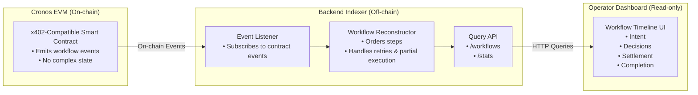

# x402 Workflow Observer  
**Grant Application – Cronos Ecosystem**

## Summary
**x402 Workflow Observer** is a workflow-level observability and debugging tool for x402-style, agent-driven payments on Cronos. It reconstructs multi-step settlement flows—intent, decisions, settlement, and completion—that are opaque in traditional block explorers.

---

## Problem
As payments on Cronos evolve toward **agentic and programmable workflows (x402)**, settlement is no longer a single transaction. Existing tooling primarily shows final state (tx hashes), making it difficult to:
- Debug failures and partial executions
- Audit execution paths across multiple steps
- Understand agent decisions and retries
- Operate automated payment systems safely

This lack of observability increases risk and slows developer velocity.

---

## Solution
We built an **end-to-end observability layer** that:
- Listens to **x402-compatible smart contract events** on Cronos
- Reconstructs **workflow execution history**
- Visualizes flows as a **timeline** showing intent → decisions → settlement → completion

The system is **read-only**, **protocol-agnostic**, and designed to become more valuable as x402 flows grow more complex.

---

## Target Users
- Cronos developers building x402-based payment systems
- Protocol teams operating agentic or automated settlements
- Infra operators auditing and monitoring on-chain workflows

---

## Key Differentiation
- **Workflow-level visibility**, not tx-level
- Focus on **execution understanding**, not payment execution
- Complements x402 primitives rather than replacing them
- Designed for **infra reliability** and operator debugging

---

## Technical Overview
- **On-chain:** x402-compatible reference contract emitting workflow events
- **Backend:** Event listener and indexer reconstructing execution history
- **Frontend:** Dashboard visualizing timelines and states for operators

Architecture is modular and extensible to additional Cronos-native x402 use cases.

---

## Architecture Overview

---

## Current Progress
- Working prototype built during the **Cronos x402 hackathon**
- Deployed reference contracts (testnet)
- Backend indexing live events
- Functional dashboard demonstrating real-time workflow observability
- Early validation through public builder discussions

_No mainnet deployment or production users yet._

---

## Roadmap on Cronos
**Next milestones (3–6 months):**
1. Harden event indexing for long-running workflows
2. Support additional x402 payment patterns on Cronos
3. Public Cronos testnet deployment for builders
4. Improve documentation and reference examples
5. Explore integrations with Cronos-native protocols using x402

**Impact:** Lower friction for complex automation, safer deployments, and increased on-chain activity driven by confidence in observability.

---

## Open Source
The project will remain **open source** to maximize ecosystem adoption and developer contribution within Cronos.

---

## Token Status
No token exists and there are **no immediate plans** to launch one. Focus remains on infrastructure and developer tooling.

---

## Grant Usage
Requested funds will be used to:
- Improve reliability and performance of on-chain event indexing
- Extend support for additional Cronos-native x402 workflows
- Maintain a public Cronos deployment
- Produce high-quality developer documentation

---

## Requested Grant Amount
**USD $12,000** (paid in cryptocurrency on Cronos)

---

## Team
- **Anubrat Sahoo** — Full-stack Web3 developer  
  Smart contracts, backend indexing, frontend dashboard

- **Advisory / Ecosystem Support (Informal)**  
  Support for developer communication and ecosystem outreach. Not involved in core protocol or smart contract development.

---

## Relevant Past Projects
- **EIP-2535 Diamond (Facets) Implementation**  
  Implemented modular smart contract architecture focusing on upgradeable execution, facet routing, and separation of concerns.

- **Arbitrum L3 → L2 Execution Mapping**  
  Explored cross-layer execution and state propagation between L3 and L2 environments.

---

## Links
- GitHub: https://github.com/<your-org>/x402-workflow-observer  
- Hackathon Submission: <DoraHacks link>  
- Demo: <demo link if available>

---

## Closing
x402 Workflow Observer provides the **missing observability layer** required for agentic payment systems to scale safely on Cronos. This grant will enable continued development beyond the hackathon and support the Cronos developer ecosystem with reliable, infrastructure-grade tooling.